# DAG Workflow Engine — Shaping Document

**Selected shape:** A (Hexagonal DAG Engine with swappable adapters)

---

## Frame

### Source

Research document `docs/research/2026-02-11-non-coroutine-distributed-dag-engine.md` provides the full technical foundation: a Hatchet-style DAG workflow engine in Kotlin without coroutines, targeting distributed multi-pod deployment with multi-tenant fairness and durable sleep. All backed by PostgreSQL alone.

Additional constraints from the project owner: hexagonal architecture, SOLID principles, constructor-based dependency injection throughout. Implementation governed by Karpathy guidelines (think before coding, simplicity first, surgical changes, goal-driven execution).

API inspiration from an existing TypeScript codebase that wraps Hatchet with a `DurableTaskEngine` interface, a `WorkflowBuilder<TInput>` pattern, and type-safe `StepRef<TOutput>` references for DAG wiring. That codebase also ships an `InProcessTaskEngine` for testing, though we chose to use a single engine with swappable adapters instead.

### Problem

The team needs a durable workflow engine that orchestrates tasks as DAGs with explicit dependencies, backed only by PostgreSQL. Workflows must survive process restarts, rolling deploys, and pod evictions. Multiple tenants share the system and must not starve each other. Multiple worker pods must claim and execute tasks concurrently. The team has no coroutine experience. The engine must be fully testable in-memory with virtual time control. Workflows need conditional branching (take different paths based on step output) and parallel fan-out (multiple steps run concurrently after a parent completes).

### Outcome

A production-grade Kotlin library that orchestrates DAGs of typed tasks with PostgreSQL as the only external dependency. Multi-tenant fairness prevents starvation. Durable sleep survives restarts. Distributed execution across pods via SKIP LOCKED. Conditional branching and parallel execution are first-class. In-memory acceptance tests run in milliseconds with deterministic time control. The codebase follows hexagonal architecture with clear port/adapter separation, SOLID principles, and constructor-based DI throughout.

---

## Requirements (R)

| ID | Requirement | Status |
|----|-------------|--------|
| R0 | Orchestrate workflows as DAGs of typed tasks with explicit dependencies | Core goal |
| R1 | PostgreSQL as the only external dependency (no Redis, Kafka, RabbitMQ) | Must-have |
| R2 | Multi-tenant fair queuing: one tenant enqueueing 10,000 tasks must not starve a tenant with 1 task | Must-have |
| R3 | Distributed workers: multiple pods claim and execute tasks concurrently | Must-have |
| R4 | Durable sleep surviving process restarts, rolling deploys, and pod evictions | Must-have |
| R5 | At-least-once delivery with idempotent tasks and cached outputs | Must-have |
| R6 | Fully testable in-memory without PostgreSQL, with virtual time control, tests complete in milliseconds | Must-have |
| R7 | No coroutine dependency: standard Java concurrency (ExecutorService, CompletableFuture, ScheduledExecutorService) | Must-have |
| R8 | Hexagonal architecture: core domain has zero infrastructure dependencies; ports define contracts; adapters implement them | Must-have |
| R9 | SOLID principles throughout: single responsibility per class, open for extension, Liskov-substitutable interfaces, interface segregation, dependency inversion | Must-have |
| R10 | Constructor-based dependency injection everywhere; no service locators, no static state, no singletons | Must-have |
| R11 | Retry with configurable backoff (exponential, max delay, max retries) | Must-have |
| R12 | Graceful shutdown: in-flight tasks drain within grace period, durable sleeps unaffected, leadership released | Must-have |
| R13 | Leader election for singleton duties (timer poller, housekeeper) via PostgreSQL advisory locks | Must-have |
| R14 | Dead execution detection via heartbeat staleness, with automatic re-enqueue or failure | Must-have |
| R15 | Fan-in correctness: concurrent parent completions must not cause duplicate child enqueue | Must-have |
| R16 | Workflow completion detection: engine detects when all tasks reach terminal state | Must-have |
| R17 | Event log: append-only record of task state transitions for observability | Nice-to-have |
| R18 | Typed workflow input: `workflow<TInput>` flows TInput to all step functions | Must-have |
| R19 | Type-safe step references: `StepRef<TOutput>` for DAG wiring and `ctx.parentOutput(ref)` retrieval | Must-have |
| R20 | onFailure handler: workflow-level callback invoked when any step fails permanently | Must-have |
| R21 | skipIf conditions: steps can be conditionally skipped based on parent output predicates | Must-have |
| R22 | Synchronous and asynchronous triggering: `workflow.run(input)` blocks until completion, `workflow.runNoWait(input)` returns immediately | Must-have |
| R23 | Conditional branching: workflows diverge into mutually exclusive execution paths based on step output; only the matching branch executes, the other is skipped with cascade | Must-have |
| R24 | Parallel execution (fan-out): multiple steps depending on the same parent execute concurrently | Must-have |

---

## Shape A: Hexagonal DAG Engine

### Consumer API

```kotlin
val engine: DurableTaskEngine = DagTaskEngine(/* injected ports */)

val orderWorkflow = engine.workflow<OrderInput>("order-processing") {
    val validate = step("validate") { input, ctx ->
        validateOrder(input)
    }

    // Conditional branching: charge only if valid, reject otherwise
    val charge = step("charge", parents = listOf(validate),
        skipIf = listOf(skipWhen(validate) { !it.isValid })
    ) { input, ctx ->
        chargeCard(ctx.parentOutput(validate))
    }

    val reject = step("reject", parents = listOf(validate),
        skipIf = listOf(skipWhen(validate) { it.isValid })
    ) { input, ctx ->
        rejectOrder(input)
    }

    // Parallel fan-out after charge
    val fraudWindow = sleep("fraud-window", Duration.ofHours(24), parents = listOf(charge))
    val prepareShipment = step("prepare-shipment", parents = listOf(charge)) { input, ctx ->
        prepareShipment(input)
    }

    // Fan-in: ship after both fraud check window and shipment prep
    val ship = step("ship", parents = listOf(fraudWindow, prepareShipment)) { input, ctx ->
        shipOrder(input)
    }

    // Merge point: finalize runs after either branch completes
    // (SKIPPED parents count as resolved for dependency purposes)
    val finalize = step("finalize", parents = listOf(ship, reject)) { input, ctx ->
        finalizeOrder(input)
    }

    onFailure { input, ctx ->
        notifyAdmin(input, ctx.workflowRunId)
    }
}

engine.start()

// Synchronous (blocks until workflow completes)
val result = orderWorkflow.run(OrderInput(...), tenantId = "customer-123")

// Asynchronous (returns immediately)
val ref = orderWorkflow.runNoWait(OrderInput(...), tenantId = "customer-123")
```

### Key API Types

```kotlin
// ── API Interfaces ────────────────────────────────────────

interface DurableTaskEngine {
    fun <TInput> workflow(
        name: String,
        block: WorkflowBuilder<TInput>.() -> Unit,
    ): Workflow<TInput>

    fun start()
    fun stop(timeout: Duration = Duration.ofSeconds(30))
}

interface Workflow<TInput> {
    val name: String
    fun run(input: TInput, tenantId: String): WorkflowResult
    fun runNoWait(input: TInput, tenantId: String): WorkflowRunRef
}

interface WorkflowBuilder<TInput> {
    fun <TOutput> step(
        name: String,
        parents: List<StepRef<*>> = emptyList(),
        retryPolicy: RetryPolicy = RetryPolicy.default(),
        skipIf: List<SkipCondition<*>> = emptyList(),
        execute: (TInput, StepContext) -> TOutput,
    ): StepRef<TOutput>

    fun sleep(
        name: String,
        duration: Duration,
        parents: List<StepRef<*>> = emptyList(),
    ): StepRef<Unit>

    fun onFailure(handler: (TInput, StepContext) -> Unit)
}

data class StepRef<TOutput>(val name: String)

class SkipCondition<T>(
    val ref: StepRef<T>,
    val predicate: (T) -> Boolean,
)

// DSL helper
fun <T> skipWhen(ref: StepRef<T>, predicate: (T) -> Boolean) =
    SkipCondition(ref, predicate)

interface StepContext {
    val workflowRunId: UUID
    val tenantId: String
    val attemptNumber: Int
    fun <T> parentOutput(ref: StepRef<T>): T
    fun heartbeat()
}

// ── Results ───────────────────────────────────────────────

data class WorkflowResult(
    val status: RunStatus,
    val outputs: Map<String, Any?>,
)

data class WorkflowRunRef(val id: UUID)

// ── Configuration ─────────────────────────────────────────

data class RetryPolicy(
    val maxRetries: Int = 0,
    val initialDelayMs: Long = 1_000,
    val backoffFactor: Double = 2.0,
    val maxDelayMs: Long = 60_000,
) {
    fun delayMs(retryCount: Int): Long {
        val delay = (initialDelayMs * backoffFactor.pow(retryCount - 1)).toLong()
        return delay.coerceAtMost(maxDelayMs)
    }

    companion object {
        fun default() = RetryPolicy()
    }
}
```

### Package Structure

```
io.effectivelabs.durable/
├── domain/
│   ├── model/           WorkflowDefinition, StepDefinition, StepRef, SkipCondition,
│   │                    RetryPolicy, TaskRecord, WorkflowRunRecord, QueueItem,
│   │                    TimerRecord, TaskEvent, TaskState, RunStatus, TerminalError
│   ├── service/         DagResolver, WorkflowCompletionChecker, RetryDelayCalculator,
│   │                    SkipEvaluator
│   └── port/            DurableTaskEngine, Workflow<T>, WorkflowBuilder<T>,
│                        StepContext, WorkflowRunRepository, TaskRepository,
│                        ReadyQueueRepository, TimerRepository, EventRepository,
│                        TaskSerializer, WorkflowRegistry
├── application/         DagTaskEngine, TaskExecutor, TaskPoller, TimerPoller,
│                        Housekeeper, HeartbeatService, LeaderElection,
│                        WorkflowHandle<T>, WorkflowBuilderImpl<T>, StepContextImpl
├── adapter/
│   ├── postgres/        Postgres*Repository, PostgresLeaderElection
│   ├── inmemory/        InMemory*Repository, InMemoryWorkflowRegistry
│   └── time/            FakeClock, ManualScheduler
└── dsl/                 Builder helpers: skipWhen()
```

**Dependency rule:** arrows point inward. Domain depends on nothing. Application depends on domain. Adapters depend on domain (implementing port interfaces). No adapter imports another adapter. No domain class imports an adapter or application class.

```
Consumer code
     │ uses
     ▼
 Port Interfaces (domain/port/)
     │ implemented by
     ▼
 Application Services (application/)
     │ also depend on port interfaces
     │
 Adapters (adapter/postgres/, adapter/inmemory/)
     │ implement port interfaces
```

### Parts

| Part | Mechanism | Flag |
|------|-----------|:----:|
| **A1** | **Domain model**: StepRef\<T\> (type-safe DAG wiring), StepDefinition (name, parents, skipIf predicates, retryPolicy, execute lambda), WorkflowDefinition (name, steps list, onFailure handler), SkipCondition\<T\> (ref + predicate lambda), RetryPolicy (maxRetries, initialDelayMs, backoffFactor, maxDelayMs, delayMs calculator), TaskRecord, WorkflowRunRecord, QueueItem, TimerRecord, TaskEvent. Enums: TaskState (PENDING, QUEUED, RUNNING, SLEEPING, COMPLETED, FAILED, CANCELLED, SKIPPED), RunStatus (RUNNING, COMPLETED, FAILED, CANCELLED), TaskEventType. TerminalError exception for non-retryable failures. | |
| **A2** | **Repository and infrastructure port interfaces**: WorkflowRunRepository (create, findById, updateStatus), TaskRepository (createAll, findByName, findAllByWorkflowRunId, updateStatus, decrementPendingParents, findDeadExecutions, heartbeat), ReadyQueueRepository (enqueue, enqueueAll, claim, claimWithConcurrencyLimit), TimerRepository (create, findExpired, markFired), EventRepository (append, findByWorkflowRunId), TaskSerializer (serialize/deserialize with generic type support), WorkflowRegistry (register, find). Each interface segregated. | |
| **A3** | **Consumer-facing port interfaces**: DurableTaskEngine (workflow, start, stop), Workflow\<TInput\> (name, run, runNoWait), WorkflowBuilder\<TInput\> (step, sleep, onFailure), StepContext (workflowRunId, tenantId, attemptNumber, parentOutput, heartbeat). | |
| **A4** | **Domain services**: DagResolver (given a completed/skipped parent, decrement pending_parent_count on children where that parent is listed; return children where count reaches 0; SKIPPED parents count as resolved for dependency purposes). WorkflowCompletionChecker (all tasks in terminal states COMPLETED/FAILED/CANCELLED/SKIPPED → workflow terminal; any FAILED → workflow FAILED, else COMPLETED). RetryDelayCalculator (exponential backoff with cap). SkipEvaluator (for a given step, deserialise parent outputs, evaluate skipIf predicates; also check if any parent is SKIPPED and cascade). All pure functions, no I/O, no state. | |
| **A5** | **TaskExecutor**: application service that executes a single step. Sequence: look up workflow definition via WorkflowRegistry → check if any parent is SKIPPED (cascade skip) → evaluate skipIf predicates → if skip, mark SKIPPED, call DagResolver for children, return → else mark RUNNING, build StepContext with parent outputs from TaskRepository, invoke user lambda, serialise output via TaskSerializer, mark COMPLETED, call DagResolver for children, enqueue ready children → on exception: if TerminalError or retries exhausted, mark FAILED, invoke onFailure if workflow transitions to FAILED; else increment retryCount, schedule re-enqueue after backoff delay. | |
| **A6** | **TaskPoller**: application service. Scheduled loop (default 200ms) that calls ReadyQueueRepository.claim(batchSize), submits each claimed item to ExecutorService worker pool for TaskExecutor to handle. Stops claiming when running=false. | |
| **A7** | **TimerPoller**: application service. Leader-only scheduled loop (default 5s). Scans TimerRepository.findExpired(), marks fired, completes the sleep task (SLEEPING → COMPLETED), calls DagResolver to resolve children, enqueues newly-ready children. | |
| **A8** | **Housekeeper**: application service. Leader-only scheduled loop (default 60s). Scans TaskRepository.findDeadExecutions(stalenessThreshold=2min) for RUNNING tasks with stale heartbeats. If retries remain, re-enqueue. If exhausted, mark FAILED and check workflow completion. | |
| **A9** | **HeartbeatService**: application service. Scheduled loop (default 30s). Calls TaskRepository.heartbeat(workerId) to UPDATE last_heartbeat on all RUNNING tasks owned by this pod. | |
| **A10** | **LeaderElection**: port interface (tryAcquire, release, isLeader) with two adapters. PostgresLeaderElection: pg_try_advisory_lock on a dedicated non-pooled connection; lock auto-releases on connection close (pod death → failover). InMemoryLeaderElection: always returns true (single-process tests are always leader). | |
| **A11** | **DagTaskEngine**: application service implementing DurableTaskEngine. Constructor-injected with all port interfaces + configuration (workerPoolSize, pollIntervalMs, timerPollIntervalMs, heartbeatIntervalMs, workerId, Clock). workflow() creates WorkflowBuilderImpl, collects step definitions, registers via WorkflowRegistry, returns WorkflowHandle. start() launches TaskPoller, HeartbeatService, and leader duties (TimerPoller + Housekeeper) on ScheduledExecutorService. stop() sets running=false, shuts down scheduler, awaits worker pool termination, releases leadership. | |
| **A12** | **WorkflowHandle\<T\>**: application class implementing Workflow\<T\>. Holds reference to engine internals. run() calls engine.trigger() (creates workflow run + task records + enqueues roots) then engine.awaitCompletion() (polls until terminal). runNoWait() calls engine.trigger(), returns WorkflowRunRef immediately. | |
| **A13** | **Ready queue with block-based fair IDs**: Hatchet's algorithm. BIGINT ID space partitioned into blocks of 1,048,576. Each tenant assigned a sequential group_id. Enqueue computes `id = group_id + BLOCK_LENGTH * block_pointer`. Dequeue: `ORDER BY id ASC FOR UPDATE SKIP LOCKED`. Natural round-robin without computation at read time. tenant_groups table tracks group IDs, task_addr_ptrs singleton tracks consumption frontier. | |
| **A14** | **Durable timer system**: durable_timers table (workflow_run_id, task_name, tenant_id, wake_at, fired). Sleep steps: write timer row with wake_at = now() + duration, set task status to SLEEPING, return immediately (no thread held). TimerPoller fires expired timers. Recovery: unfired timer rows survive restarts, picked up by next leader. | |
| **A15** | **Skip evaluation + cascade**: SkipEvaluator checks two conditions before a step executes. First: is any parent SKIPPED? If so, this step is also SKIPPED (cascade). Second: evaluate skipIf predicates by deserialising the referenced parent's output and applying the predicate lambda. If any predicate returns true, step is SKIPPED. When a step is SKIPPED, DagResolver treats it identically to COMPLETED for pending_parent_count purposes (children become ready). parentOutput(ref) for a SKIPPED parent returns null. This mechanism implements conditional branching: define both branches as steps with complementary skipIf predicates on the same parent. | |
| **A16** | **onFailure handler**: stored on WorkflowDefinition. When a step fails permanently (retries exhausted or TerminalError) AND the workflow transitions to FAILED status, the engine creates a special execution context (with failureError available) and invokes the handler with the original workflow input. The handler itself is not retried. | |
| **A17** | **In-memory adapters**: InMemoryWorkflowRunRepository (ConcurrentHashMap), InMemoryTaskRepository (ConcurrentHashMap with synchronized decrementPendingParents to simulate PostgreSQL row-level serialisation), InMemoryReadyQueueRepository (PriorityBlockingQueue ordered by id, with block-based ID computation mirroring the Postgres algorithm for fairness testing), InMemoryTimerRepository (synchronised list with FakeClock for expiry), InMemoryEventRepository (append-only list), InMemoryWorkflowRegistry (ConcurrentHashMap). | |
| **A18** | **FakeClock + ManualScheduler**: FakeClock extends java.time.Clock, provides advance(Duration) and set(Instant). ManualScheduler implements ScheduledExecutorService, captures scheduled tasks, provides tick() to execute due tasks, advanceBy(Duration) to advance clock and tick, drainAll() to run everything. Used in tests for deterministic time control. | |
| **A19** | **PostgreSQL adapters**: PostgresWorkflowRunRepository, PostgresTaskRepository (SKIP LOCKED claiming, atomic pending_parent_count decrement, heartbeat UPDATE, dead execution scan), PostgresReadyQueueRepository (block-based enqueue CTE with tenant_groups upsert, ORDER BY id ASC FOR UPDATE SKIP LOCKED claim), PostgresTimerRepository (findExpired with SKIP LOCKED, markFired), PostgresEventRepository. PostgresLeaderElection (advisory lock on dedicated connection). | |
| **A20** | **PostgreSQL schema**: DDL migration for tables: workflow_runs, tasks (composite PK workflow_run_id + task_name, with parent_names array and pending_parent_count), ready_queue (BIGINT id computed by block algorithm, unique index on workflow_run_id + task_name), durable_timers, task_events, tenant_groups, task_addr_ptrs (singleton). Partial indexes on active states. | |
| **A21** | **Graceful shutdown**: DagTaskEngine.stop(timeout) sequence: set running=false → scheduler.shutdown() (no more polling) → workerPool.shutdown() + awaitTermination(timeout) (drain in-flight) → workerPool.shutdownNow() if timeout exceeded (interrupt) → leaderElection.release(). Interrupted tasks leave RUNNING status; housekeeper on another pod detects and re-enqueues within 2 minutes. | |
| **A22** | **Test harness**: TestEngineBuilder that wires all in-memory adapters + FakeClock + ManualScheduler, provides helpers: runCycle() (one poll-execute cycle), runUntilComplete(workflowRunId) (loop until terminal or blocked on sleep), advanceTime(duration) (advance FakeClock + fire expired timers + execute ready tasks). Deterministic, single-threaded test execution. | |

---

## Fit Check (R × A)

| Req | Requirement | Status | A |
|-----|-------------|--------|---|
| R0 | Orchestrate workflows as DAGs of typed tasks with explicit dependencies | Core goal | ✅ |
| R1 | PostgreSQL as the only external dependency | Must-have | ✅ |
| R2 | Multi-tenant fair queuing: one tenant's bulk load must not starve another | Must-have | ✅ |
| R3 | Distributed workers: multiple pods claim and execute tasks concurrently | Must-have | ✅ |
| R4 | Durable sleep surviving process restarts, rolling deploys, and pod evictions | Must-have | ✅ |
| R5 | At-least-once delivery with idempotent tasks and cached outputs | Must-have | ✅ |
| R6 | Fully testable in-memory without PostgreSQL, with virtual time control, tests in milliseconds | Must-have | ✅ |
| R7 | No coroutine dependency: standard Java concurrency | Must-have | ✅ |
| R8 | Hexagonal architecture: core domain has zero infrastructure dependencies | Must-have | ✅ |
| R9 | SOLID principles throughout | Must-have | ✅ |
| R10 | Constructor-based DI everywhere; no service locators, no static state, no singletons | Must-have | ✅ |
| R11 | Retry with configurable backoff | Must-have | ✅ |
| R12 | Graceful shutdown: drain in-flight, release leadership | Must-have | ✅ |
| R13 | Leader election via PostgreSQL advisory locks | Must-have | ✅ |
| R14 | Dead execution detection via heartbeat staleness | Must-have | ✅ |
| R15 | Fan-in correctness: no duplicate child enqueue on concurrent parent completion | Must-have | ✅ |
| R16 | Workflow completion detection: engine detects all tasks terminal | Must-have | ✅ |
| R17 | Event log: append-only record of task state transitions | Nice-to-have | ✅ |
| R18 | Typed workflow input: TInput flows to all step functions | Must-have | ✅ |
| R19 | Type-safe step references: StepRef\<TOutput\> for wiring and retrieval | Must-have | ✅ |
| R20 | onFailure handler: workflow-level callback on permanent step failure | Must-have | ✅ |
| R21 | skipIf conditions: conditionally skip steps based on parent output predicates | Must-have | ✅ |
| R22 | Synchronous and asynchronous triggering | Must-have | ✅ |
| R23 | Conditional branching: mutually exclusive paths based on step output, with cascade | Must-have | ✅ |
| R24 | Parallel execution (fan-out): multiple steps with same parent run concurrently | Must-have | ✅ |

**Notes:**

- R23 (branching) is implemented via A15 (skipIf + cascade). Both branches exist as steps in the DAG with complementary skipIf predicates on the decision point step. The cascade behaviour (SKIPPED parent → SKIPPED children) ensures the entire non-matching branch is skipped. No separate branching primitive is needed.
- R24 (parallel fan-out) is inherent in the DAG model (A4). Multiple steps listing the same parent as a dependency are enqueued simultaneously when that parent completes. Each is claimed independently by the worker pool.
- R15 (fan-in) is handled by A4 (DagResolver): pending_parent_count is decremented atomically; only the decrement that reaches 0 enqueues the child. PostgreSQL row-level serialisation prevents double-enqueue. Defence-in-depth: unique index on ready_queue(workflow_run_id, task_name).

---

## Branching Mechanism (Detail)

Branching does not require a new engine primitive. It is a pattern built on skipIf + cascade + the rule that SKIPPED parents count as resolved for fan-in.

### How It Works

Given a decision step `validate` whose output includes an `isValid` boolean:

```
validate
├── charge    (skipIf: !isValid)  →  prepare-shipment
│                                           │
│                                     fraud-window (sleep 24h)
│                                           │
│                                         ship
└── reject    (skipIf: isValid)   →  notify-rejection
                                           │
                                       ┌───┘
                                       ▼
                                   finalize  (depends on: ship, notify-rejection)
```

When `validate` completes with `isValid = true`:

- `charge`: skipIf predicate `{ !it.isValid }` evaluates to false → executes
- `reject`: skipIf predicate `{ it.isValid }` evaluates to true → SKIPPED
- `notify-rejection`: parent `reject` is SKIPPED → cascade → SKIPPED
- `finalize`: depends on `ship` and `notify-rejection`. `notify-rejection` is SKIPPED (counts as resolved). `finalize` becomes ready when `ship` completes.

When `validate` completes with `isValid = false`:

- `charge`: SKIPPED
- `prepare-shipment`, `fraud-window`, `ship`: cascade SKIPPED
- `reject`: executes
- `notify-rejection`: executes
- `finalize`: `ship` is SKIPPED (resolved), `notify-rejection` completes → `finalize` runs

### parentOutput for SKIPPED Parents

`ctx.parentOutput(ref)` for a SKIPPED parent returns `null`. Steps at merge points (like `finalize`) can check which branch ran:

```kotlin
val finalize = step("finalize", parents = listOf(ship, notifyRejection)) { input, ctx ->
    val shipResult = ctx.parentOutput(ship)       // non-null if valid branch ran
    val rejectResult = ctx.parentOutput(notifyRejection)  // non-null if invalid branch ran
    // exactly one is non-null
    completeOrder(shipResult, rejectResult)
}
```

---

## Slicing

### Slice Overview

| Slice | Name | Parts | Acceptance Test |
|-------|------|-------|-----------------|
| **V1** | Domain model + ports + DSL | A1, A2, A3 | Unit: build workflow via DSL, verify DAG structure. Verify StepRef types. Verify RetryPolicy.delayMs calculation. |
| **V2** | Domain services | A4 | Unit: DagResolver decrements and returns ready children. DagResolver treats SKIPPED as resolved. WorkflowCompletionChecker determines terminal status. RetryDelayCalculator computes exponential backoff. SkipEvaluator evaluates predicates and cascades. |
| **V3** | In-memory adapters + test harness | A17, A18, A22 | Unit: InMemoryTaskRepository CRUD + decrementPendingParents atomicity. InMemoryReadyQueue enqueue/claim ordering. InMemoryTimerRepository create/findExpired with FakeClock. ManualScheduler tick/advanceBy. |
| **V4** | Engine core: linear DAG | A5, A6, A11, A12 | Acceptance: a → b → c, outputs flow via parentOutput(), workflow completes with COMPLETED status, run() returns WorkflowResult. |
| **V5** | Engine core: fan-out/fan-in | (A4 wiring in A5) | Acceptance: diamond (a → b,c → d), d receives both parent outputs. Wide fan-out (a → b,c,d,e → f). |
| **V6** | Engine core: retry + failure + onFailure | A5 (retry path), A16 | Acceptance: flaky step succeeds on retry 3. Step fails permanently → workflow FAILED. onFailure handler invoked with error context. TerminalError skips retries. |
| **V7** | skipIf + branching | A15 | Acceptance: step skipped based on parent output predicate. Skip cascades through descendants. Complementary skipIf predicates create a branch: only matching branch executes. Fan-in after branch: SKIPPED parent counts as resolved. parentOutput returns null for SKIPPED. |
| **V8** | Durable sleep | A7, A14 | Acceptance: sleep pauses workflow (SLEEPING status), FakeClock.advance(25h) fires timer, downstream steps execute. Sleep within a branch. |
| **V9** | Multi-tenant fair queuing | A13 | Acceptance: tenant B enqueues 5 workflows, tenant A enqueues 1, tenant A served within first 2 executions. Block-based ID computation verified. |
| **V10** | PostgreSQL schema + adapters | A19, A20 | Integration (Testcontainers): SKIP LOCKED claiming under contention. Block-based fair enqueue. Atomic pending_parent decrement (concurrent UPDATEs). Timer fire + markFired. Heartbeat update. |
| **V11** | Distributed coordination + shutdown | A8, A9, A10, A21 | Integration: heartbeat + dead execution detection + re-enqueue. Advisory lock leader election + failover on connection close. Graceful drain within timeout. |
| **V12** | Event log | A17 (event), A19 (event) | Integration: trigger workflow, verify complete event trail (QUEUED → STARTED → COMPLETED per task, SKIPPED for branched steps, SLEEPING → WOKEN for sleep). |

### Slice Dependencies

```
V1 ← V2 ← V3 ← V4 ← V5 ← V6 ← V7 ← V8 ← V9
                                                  \
                                                   V10 ← V11 ← V12
```

V1-V9 are pure in-memory (no PostgreSQL). V10-V12 add infrastructure.

### Slice Detail

#### V1: Domain Model + Ports + DSL

**Goal:** All value objects, enums, port interfaces, and the workflow builder DSL compile and have unit tests.

**Files created:**
- `domain/model/StepRef.kt`
- `domain/model/StepDefinition.kt`
- `domain/model/WorkflowDefinition.kt`
- `domain/model/SkipCondition.kt`
- `domain/model/RetryPolicy.kt`
- `domain/model/TaskRecord.kt`
- `domain/model/WorkflowRunRecord.kt`
- `domain/model/QueueItem.kt`
- `domain/model/TimerRecord.kt`
- `domain/model/TaskEvent.kt`
- `domain/model/TaskState.kt`
- `domain/model/RunStatus.kt`
- `domain/model/TerminalError.kt`
- `domain/model/WorkflowResult.kt`
- `domain/model/WorkflowRunRef.kt`
- `domain/port/DurableTaskEngine.kt`
- `domain/port/Workflow.kt`
- `domain/port/WorkflowBuilder.kt`
- `domain/port/StepContext.kt`
- `domain/port/WorkflowRunRepository.kt`
- `domain/port/TaskRepository.kt`
- `domain/port/ReadyQueueRepository.kt`
- `domain/port/TimerRepository.kt`
- `domain/port/EventRepository.kt`
- `domain/port/TaskSerializer.kt`
- `domain/port/WorkflowRegistry.kt`
- `dsl/SkipWhen.kt`

**Tests:**
- Build a workflow with the DSL: verify step count, parent linkages, sleep steps
- RetryPolicy.delayMs: verify exponential backoff with cap
- StepRef carries type parameter (compile-time check)
- WorkflowDefinition captures onFailure handler

#### V2: Domain Services

**Goal:** Pure domain logic, fully unit-tested with hand-crafted records.

**Files created:**
- `domain/service/DagResolver.kt`
- `domain/service/WorkflowCompletionChecker.kt`
- `domain/service/RetryDelayCalculator.kt`
- `domain/service/SkipEvaluator.kt`

**Tests:**
- DagResolver: given parent "a" completed, decrement children; child with count=0 returned as ready
- DagResolver: SKIPPED parent counts as resolved (same decrement behaviour)
- DagResolver: fan-in — two parents, first completion returns empty, second returns the child
- WorkflowCompletionChecker: all COMPLETED → COMPLETED, any FAILED → FAILED, mix of COMPLETED+SKIPPED → COMPLETED
- WorkflowCompletionChecker: SLEEPING task present → not terminal
- RetryDelayCalculator: exponential sequence 1000, 2000, 4000, capped at maxDelayMs
- SkipEvaluator: predicate returns true → SKIP, returns false → EXECUTE
- SkipEvaluator: parent SKIPPED → cascade SKIP regardless of predicate

#### V3: In-Memory Adapters + Test Harness

**Goal:** All in-memory port implementations pass unit tests. Test harness wires everything.

**Files created:**
- `adapter/inmemory/InMemoryWorkflowRunRepository.kt`
- `adapter/inmemory/InMemoryTaskRepository.kt`
- `adapter/inmemory/InMemoryReadyQueueRepository.kt`
- `adapter/inmemory/InMemoryTimerRepository.kt`
- `adapter/inmemory/InMemoryEventRepository.kt`
- `adapter/inmemory/InMemoryWorkflowRegistry.kt`
- `adapter/inmemory/InMemoryLeaderElection.kt`
- `adapter/time/FakeClock.kt`
- `adapter/time/ManualScheduler.kt`
- `application/TestEngineBuilder.kt`

**Tests:**
- InMemoryTaskRepository: createAll, findByName, updateStatus, decrementPendingParents returns ready children
- InMemoryReadyQueueRepository: enqueue/claim respects ordering, claim removes from queue
- InMemoryTimerRepository: findExpired returns nothing before wake_at, returns timer after FakeClock.advance()
- FakeClock: advance/set behaves correctly
- ManualScheduler: scheduled task fires after advanceBy, tick executes due tasks

#### V4: Engine Core — Linear DAG

**Goal:** The engine can execute a → b → c and return a result.

**Files created:**
- `application/DagTaskEngine.kt`
- `application/TaskExecutor.kt`
- `application/TaskPoller.kt`
- `application/WorkflowHandle.kt`
- `application/WorkflowBuilderImpl.kt`
- `application/StepContextImpl.kt`

**Tests:**
- Linear workflow: a → b → c, each step receives TInput, parentOutput(prev) returns previous output
- Workflow completes with COMPLETED status
- run() returns WorkflowResult with all outputs
- runNoWait() returns WorkflowRunRef with valid UUID

#### V5: Engine Core — Fan-Out/Fan-In

**Goal:** Diamond and wide fan-out patterns work.

**Tests:**
- Diamond: a → (b, c) → d. Step d receives outputs from both b and c.
- Wide fan-out: a → (b, c, d, e) → f. All four intermediate steps execute, f receives all outputs.
- Two independent roots: (a, b) both start immediately (no parents).

#### V6: Engine Core — Retry + Failure + onFailure

**Goal:** Retry with backoff works. Permanent failure triggers onFailure.

**Tests:**
- Flaky step: fails twice, succeeds on attempt 3 (maxRetries=2). Workflow COMPLETED.
- Permanent failure: step always throws, maxRetries=2. After 3 attempts, workflow FAILED.
- TerminalError: step throws TerminalError on first attempt. No retry. Workflow FAILED immediately.
- onFailure handler: invoked exactly once when workflow transitions to FAILED. Receives original input and context with error.
- Retry backoff: verify delay between retries follows exponential schedule (using ManualScheduler assertions).

#### V7: skipIf + Branching

**Goal:** Conditional branching via skipIf works with cascade and merge.

**Tests:**
- Single skipIf: step skipped when predicate returns true. Step output is null.
- Cascade: step A skipped → child B auto-skipped → grandchild C auto-skipped.
- Branch pattern: validate → (charge with skipIf !valid, reject with skipIf valid). Only matching branch executes.
- Branch with fan-in merge: finalize depends on both branches. SKIPPED branch counts as resolved. finalize runs after the active branch completes.
- parentOutput for SKIPPED parent returns null.
- Multiple skipIf predicates on one step: any true → skip (OR semantics).

#### V8: Durable Sleep

**Goal:** Sleep persists as a timer row, survives clock advancement, wakes up correctly.

**Tests:**
- Sleep step: task transitions to SLEEPING, timer row created with correct wake_at.
- Timer fire: FakeClock.advance(duration + 1s), timer poller fires, task → COMPLETED, children enqueued.
- Sleep in a chain: a → sleep(1h) → b. After advance(1h), b executes.
- Sleep in a branch: valid → sleep(24h) → ship; invalid → reject. Only the active branch's sleep fires.
- Multiple concurrent sleeps: two sleep tasks in parallel branches, both fire independently.

#### V9: Multi-Tenant Fair Queuing

**Goal:** Block-based ID computation produces interleaved ordering.

**Tests:**
- Two tenants, 1 task each: IDs are group_id + 0, interleaved.
- Tenant B enqueues 5, Tenant A enqueues 1: Tenant A's task appears within first 2 claimed items.
- Ten tenants, varying load: verify round-robin interleaving via ORDER BY id ASC.
- Block pointer advances: same tenant enqueuing multiple tasks gets incrementing block_pointer.

#### V10: PostgreSQL Schema + Adapters

**Goal:** All Postgres repository implementations pass integration tests.

**Files created:**
- `adapter/postgres/PostgresWorkflowRunRepository.kt`
- `adapter/postgres/PostgresTaskRepository.kt`
- `adapter/postgres/PostgresReadyQueueRepository.kt`
- `adapter/postgres/PostgresTimerRepository.kt`
- `adapter/postgres/PostgresEventRepository.kt`
- `adapter/postgres/PostgresLeaderElection.kt`
- `resources/db/migration/V1__initial_schema.sql`

**Tests (Testcontainers):**
- SKIP LOCKED: two concurrent claims, no task claimed twice.
- Block-based enqueue: verify computed IDs match expected formula.
- Atomic pending_parent decrement: two concurrent parent completions, child enqueued exactly once.
- Timer findExpired + markFired: verify timing with real timestamps.
- Heartbeat update: verify last_heartbeat column updated.
- Schema: all tables created, constraints enforced.

#### V11: Distributed Coordination + Shutdown

**Goal:** Leader election, heartbeat, housekeeper, graceful shutdown work end-to-end.

**Files created:**
- `application/HeartbeatService.kt`
- `application/Housekeeper.kt`
- `application/TimerPoller.kt` (already exists from V8 but now wired to leader election)

**Tests (Testcontainers):**
- Leader election: one pod acquires lock, second fails. First releases, second acquires.
- Failover: close leader's connection, verify another pod becomes leader.
- Dead execution: stop a pod's heartbeat, housekeeper detects and re-enqueues task.
- Graceful shutdown: trigger workflow, call stop() mid-execution, verify in-flight task completes.

#### V12: Event Log

**Goal:** Complete event trail for workflow observability.

**Tests:**
- Trigger linear workflow, verify events: each task has QUEUED → STARTED → COMPLETED.
- Trigger workflow with skipIf branch: skipped tasks have SKIPPED event.
- Trigger workflow with sleep: sleep task has SLEEPING → WOKEN events.
- Trigger workflow with retry: failed task has STARTED → RETRYING → STARTED → COMPLETED events.
- Trigger workflow with permanent failure: STARTED → FAILED event, onFailure invocation logged.

---

## Decisions Made During Shaping

| Decision | Choice | Alternatives Considered |
|----------|--------|-------------------------|
| Architecture | Full hexagonal (domain/ports/adapters) in single Gradle module | Multi-module Gradle (rejected: premature for codebase size), pragmatic hexagonal (rejected: user wants full separation) |
| Engine pattern | One engine (DagTaskEngine) with swappable adapters | Two independent engines (InProcessTaskEngine + DagTaskEngine) sharing interface (rejected: duplicates DAG resolution logic) |
| Fair queuing | Block-based ID encoding from day one | Per-tenant slot limiting (rejected: no round-robin interleaving, would need rework later) |
| Serialisation | TaskSerializer port interface, adapter for kotlinx-serialization | Baked-in kotlinx-serialization (rejected: couples library to specific framework) |
| Workflow registry | WorkflowRegistry port interface | Simple Map\<String, WorkflowDefinition\> (rejected: user wanted port interface for flexibility) |
| Branching | skipIf predicates + cascade (no new primitive) | First-class branch DSL (deferred: can be added as DSL sugar over skipIf later) |
| Coroutines | Not used. ExecutorService + ScheduledExecutorService + CompletableFuture. | Coroutine-based engine (rejected: team has no coroutine experience) |
| API style | Builder DSL on engine: `engine.workflow<T>("name") { step(...) }` returning `Workflow<T>` | Standalone workflow {} function returning WorkflowDefinition (rejected: inspiration code's API is cleaner) |

---

## Breadboard

### Places

| # | Place | Description |
|---|-------|-------------|
| P1 | Consumer Code | User-written code: defines workflows via DSL, triggers runs, reads results |
| P2 | Engine Surface | DagTaskEngine + WorkflowHandle + WorkflowBuilderImpl: lifecycle, registration, triggering |
| P3 | Task Processing | TaskPoller + TaskExecutor: the poll-claim-execute-resolve loop (every pod) |
| P4 | Leader Services | TimerPoller + Housekeeper: singleton duties, leader-elected pod only |
| P5 | Domain Logic | Pure stateless functions: DagResolver, SkipEvaluator, WorkflowCompletionChecker, RetryDelayCalculator |
| P6 | Storage | Repository implementations + backing data stores (PostgreSQL tables or in-memory collections) |

### Data Stores

| # | Place | Store | Description |
|---|-------|-------|-------------|
| S1 | P6 | `workflow_runs` | Run records: id, workflow_name, tenant_id, status, input, timestamps |
| S2 | P6 | `tasks` | Task records: status, parent_names, pending_parent_count, output, error, retry_count, claimed_by, last_heartbeat |
| S3 | P6 | `ready_queue` | Fair-queued items awaiting claim. BIGINT id computed by block algorithm. Consumed via SKIP LOCKED. |
| S4 | P6 | `durable_timers` | Timer rows for sleep tasks: wake_at, fired flag |
| S5 | P6 | `task_events` | Append-only event log: state transitions per task |
| S6 | P6 | `tenant_groups` | Tenant → sequential group_id mapping for block-based fair queuing |
| S7 | P6 | `task_addr_ptrs` | Singleton: max_assigned_block_addr (consumption frontier) |
| S8 | P6 | `advisory_lock` | PostgreSQL advisory lock for leader election (connection-scoped) |
| S9 | P6 | `workflow_definitions` | Registered workflow definitions (name → definition) |

### Code Affordances

#### P1: Consumer Code

| # | Place | Component | Affordance | Control | Wires Out | Returns To |
|---|-------|-----------|------------|---------|-----------|------------|
| N1 | P1 | consumer | `engine.workflow<T>("name") { ... }` | call | → N10 | ← N18 |
| N2 | P1 | DSL block | `step("name", parents, skipIf) { lambda }` | call | → N13 | ← StepRef\<T\> |
| N3 | P1 | DSL block | `sleep("name", duration, parents)` | call | → N14 | ← StepRef\<Unit\> |
| N4 | P1 | DSL block | `skipWhen(ref) { predicate }` | call | — | ← SkipCondition |
| N5 | P1 | DSL block | `onFailure { input, ctx -> ... }` | call | → N15 | — |
| N6 | P1 | consumer | `workflow.run(input, tenantId)` | call | → N19 | ← WorkflowResult |
| N7 | P1 | consumer | `workflow.runNoWait(input, tenantId)` | call | → N20 | ← WorkflowRunRef |
| N8 | P1 | consumer | `engine.start()` | call | → N21 | — |
| N9 | P1 | consumer | `engine.stop(timeout)` | call | → N22 | — |

#### P2: Engine Surface

| # | Place | Component | Affordance | Control | Wires Out | Returns To |
|---|-------|-----------|------------|---------|-----------|------------|
| N10 | P2 | DagTaskEngine | `workflow()`: create builder, execute DSL block | call | → N16 | — |
| N11 | P2 | WorkflowBuilderImpl | collects StepDefinitions into list | accumulate | — | — |
| N12 | P2 | WorkflowBuilderImpl | `build()`: produce WorkflowDefinition | call | → N17 | — |
| N13 | P2 | WorkflowBuilderImpl | `step()`: record StepDefinition, return StepRef | call | → N11 | → N2 |
| N14 | P2 | WorkflowBuilderImpl | `sleep()`: record sleep StepDefinition, return StepRef | call | → N11 | → N3 |
| N15 | P2 | WorkflowBuilderImpl | `onFailure()`: store handler on definition | call | — | — |
| N16 | P2 | DagTaskEngine | `build()` + register definition | call | → N12, → N17 | — |
| N17 | P2 | WorkflowRegistry | `register(definition)` | write | → S9 | — |
| N18 | P2 | DagTaskEngine | return `WorkflowHandle<T>` | return | — | → N1 |
| N19 | P2 | WorkflowHandle | `run()`: trigger + awaitCompletion | call | → N23, → N28 | → N6 |
| N20 | P2 | WorkflowHandle | `runNoWait()`: trigger, return ref | call | → N23 | → N7 |
| N21 | P2 | DagTaskEngine | `start()`: launch pollers on ScheduledExecutorService | call | → N30, → N39, → N70 | — |
| N22 | P2 | DagTaskEngine | `stop()`: running=false → drain pool → release leader | call | → N80 | — |
| N23 | P2 | DagTaskEngine | `trigger()`: create run + tasks + enqueue roots | call | → S1, → S2, → N53, → S3 | — |
| N28 | P2 | DagTaskEngine | `awaitCompletion()`: poll S1 until terminal | poll | ← S1 | → N19 |

#### P3: Task Processing

| # | Place | Component | Affordance | Control | Wires Out | Returns To |
|---|-------|-----------|------------|---------|-----------|------------|
| N30 | P3 | TaskPoller | `poll()`: scheduled loop (every 200ms) | schedule | → N31 | — |
| N31 | P3 | ReadyQueueRepo | `claim(batchSize)`: SKIP LOCKED + delete | call | → S3 | → N32 |
| N32 | P3 | TaskPoller | submit claimed items to ExecutorService | call | → N33 | — |
| N33 | P3 | TaskExecutor | `execute(workflowRunId, taskName)` | call | ← S9, ← S2, → N36 | — |
| N36 | P3 | TaskExecutor | evaluate skip: check parents + skipIf predicates | call | → N55 | — |
| N37 | P3 | TaskExecutor | if SKIP → mark SKIPPED, resolve children | call | → S2, → N41 | — |
| N39 | P3 | HeartbeatService | `beat()`: scheduled loop (every 30s) | schedule | → N40 | — |
| N40 | P3 | TaskRepo | `heartbeat(workerId)`: UPDATE last_heartbeat | write | → S2 | — |
| N41 | P3 | TaskExecutor | resolveChildren: call DagResolver, enqueue ready, check completion | call | → N56, → N42, → N52 | — |
| N42 | P3 | ReadyQueueRepo | `enqueueAll(readyChildren)` with block-based IDs | write | → N53, → S3 | — |
| N43 | P3 | TaskExecutor | execute step: mark RUNNING → build ctx → invoke lambda | call | → S2, → N46 | — |
| N45 | P3 | StepContextImpl | `parentOutput(ref)`: deserialise parent output from S2 | call | ← S2 | → user lambda |
| N46 | P3 | TaskExecutor | invoke user lambda: `execute(input, ctx)` | call | — | → N49 or → N60 |
| N49 | P3 | TaskExecutor | success: serialise output → COMPLETED → resolve | call | → S2, → N41 | — |
| N52 | P3 | TaskExecutor | check workflow completion | call | → N57, → S1 | — |
| N53 | P3 | ReadyQueueRepo | block-based ID computation: group_id + BLOCK_LENGTH * block_ptr | call | → S6, → S7 | — |
| N60 | P3 | TaskExecutor | failure: catch exception from user lambda | call | → N63 or → N61 | — |
| N61 | P3 | TaskExecutor | terminal failure: FAILED → check completion → onFailure | call | → S2, → N52, → N65 | — |
| N63 | P3 | TaskExecutor | retriable: schedule re-enqueue after backoff | call | → N59a, → S2, (delayed) → N42 | — |
| N65 | P3 | TaskExecutor | invoke onFailure handler if workflow → FAILED | call | — | — |
| N66 | P3 | TaskExecutor | sleep step: write timer → SLEEPING | call | → S2, → S4 | — |

#### P4: Leader Services

| # | Place | Component | Affordance | Control | Wires Out | Returns To |
|---|-------|-----------|------------|---------|-----------|------------|
| N70 | P4 | LeaderElection | `tryAcquire()`: pg_try_advisory_lock | call | → S8 | — |
| N72 | P4 | TimerPoller | `poll()`: scheduled loop (5s, leader only) | schedule | → N73 | — |
| N73 | P4 | TimerRepo | `findExpired(limit)`: SKIP LOCKED where wake_at <= now | read | → S4 | → N74 |
| N74 | P4 | TimerPoller | fire timer: markFired → complete task → resolve children | call | → S4, → S2, → N41 | — |
| N76 | P4 | Housekeeper | `scan()`: scheduled loop (60s, leader only) | schedule | → N77 | — |
| N77 | P4 | TaskRepo | `findDeadExecutions(2min)`: RUNNING + stale heartbeat | read | → S2 | → N78 or → N79 |
| N78 | P4 | Housekeeper | retriable → re-enqueue | call | → N42 | — |
| N79 | P4 | Housekeeper | exhausted → FAILED → check completion | call | → S2, → N52 | — |
| N80 | P4 | LeaderElection | `release()`: pg_advisory_unlock | call | → S8 | — |

#### P5: Domain Logic

| # | Place | Component | Affordance | Control | Wires Out | Returns To |
|---|-------|-----------|------------|---------|-----------|------------|
| N55 | P5 | SkipEvaluator | `shouldSkip()`: cascade check + predicate evaluation | call | — | → N36 |
| N56 | P5 | DagResolver | `resolveChildren()`: decrement pending_parent_count, return ready (SKIPPED counts as resolved) | call | → S2 | → N41 |
| N57 | P5 | CompletionChecker | `check()`: all terminal? FAILED if any failed, else COMPLETED | call | — | → N52 |
| N59a | P5 | RetryDelayCalculator | `delayMs()`: exponential backoff with cap | call | — | → N63 |

### Workflow Traces

#### Trace A: Linear DAG (happy path)

| Step | What happens | Path |
|------|-------------|------|
| 1 | Consumer defines workflow via DSL | N1 → N10 → N11 → N12 → N17 → S9 |
| 2 | Consumer triggers run | N6 → N19 → N23 → S1, S2, S3 |
| 3 | TaskPoller claims root task | N30 → N31 → S3 → N32 |
| 4 | TaskExecutor: no skip, RUNNING, invoke lambda | N33 → N36 → N55 → N43 → N46 |
| 5 | Success: COMPLETED, resolve children | N49 → S2 → N41 → N56 → S2 → N42 → S3 |
| 6 | Repeat 3-5 for each step in topological order | N30 → ... → N41 |
| 7 | Final step: all terminal → workflow COMPLETED | N52 → N57 → S1 |
| 8 | awaitCompletion returns result | N28 ← S1 → N6 |

#### Trace B: Branching (skipIf + cascade)

| Step | What happens | Path |
|------|-------------|------|
| 1 | validate completes with `isValid = false` | N49 → S2, N41 → N56 |
| 2 | Both `charge` and `reject` become ready | N42 → S3 |
| 3 | charge: SkipEvaluator returns SKIP | N33 → N36 → N55 (SKIP) |
| 4 | charge SKIPPED, children cascade-skip | N37 → S2, N41 → N56 (cascade) |
| 5 | reject: SkipEvaluator returns EXECUTE | N33 → N36 → N55 (EXECUTE) |
| 6 | reject executes normally | N43 → N46 → N49 |
| 7 | Merge: SKIPPED + COMPLETED both resolved → finalize enqueued | N56 → S2 (pending=0) → N42 |

#### Trace C: Durable Sleep

| Step | What happens | Path |
|------|-------------|------|
| 1 | Sleep step claimed and recognised | N33 → N36 → N66 |
| 2 | Timer written, task SLEEPING, returns | N66 → S4, S2 |
| 3 | (24 hours pass, no resources held) | — |
| 4 | TimerPoller finds expired timer | N72 → N73 → S4 |
| 5 | Fire: mark fired, complete task, resolve children | N74 → S4, S2, N41 |

#### Trace D: Retry with Backoff

| Step | What happens | Path |
|------|-------------|------|
| 1 | User lambda throws exception | N46 → N60 |
| 2 | Retriable: compute delay, schedule re-enqueue | N60 → N63 → N59a, S2, (delayed) → N42 → S3 |
| 3 | After delay: task reappears, re-executes | N30 → N31 → N33 |

#### Trace E: Dead Execution Recovery

| Step | What happens | Path |
|------|-------------|------|
| 1 | Pod dies, heartbeat stops | N39 stops |
| 2 | Housekeeper finds stale task | N76 → N77 → S2 |
| 3 | Re-enqueue or fail | N78 → N42 or N79 → S2, N52 |

### Mermaid Diagram

```mermaid
flowchart TB
    subgraph P1["P1: Consumer Code"]
        N1["N1: engine.workflow()"]
        N6["N6: workflow.run()"]
        N7["N7: workflow.runNoWait()"]
        N8["N8: engine.start()"]
        N9["N9: engine.stop()"]
    end

    subgraph P2["P2: Engine Surface"]
        N10["N10: workflow(): create builder"]
        N13["N13: step(): record def"]
        N14["N14: sleep(): record def"]
        N15["N15: onFailure(): store handler"]
        N11["N11: collect StepDefinitions"]
        N12["N12: build(): WorkflowDefinition"]
        N16["N16: build + register"]
        N17["N17: WorkflowRegistry.register()"]
        N18["N18: return WorkflowHandle"]
        N19["N19: run(): trigger + await"]
        N20["N20: runNoWait(): trigger"]
        N21["N21: start(): launch pollers"]
        N22["N22: stop(): drain + release"]
        N23["N23: trigger(): create run + enqueue"]
        N28["N28: awaitCompletion(): poll"]
    end

    subgraph P3["P3: Task Processing"]
        N30["N30: TaskPoller.poll() (200ms)"]
        N31["N31: ReadyQueue.claim()"]
        N32["N32: submit to worker pool"]
        N33["N33: TaskExecutor.execute()"]
        N36["N36: evaluate skip"]
        N37["N37: mark SKIPPED + resolve"]
        N39["N39: HeartbeatService (30s)"]
        N40["N40: heartbeat(workerId)"]
        N41["N41: resolveChildren"]
        N42["N42: enqueueAll(ready)"]
        N43["N43: mark RUNNING + invoke"]
        N45["N45: parentOutput(ref)"]
        N46["N46: invoke user lambda"]
        N49["N49: success: COMPLETED"]
        N52["N52: check completion"]
        N53["N53: block-based ID compute"]
        N60["N60: failure: catch"]
        N61["N61: terminal: FAILED"]
        N63["N63: retriable: backoff"]
        N65["N65: invoke onFailure"]
        N66["N66: sleep: write timer"]
    end

    subgraph P4["P4: Leader Services"]
        N70["N70: tryAcquire() advisory lock"]
        N72["N72: TimerPoller.poll() (5s)"]
        N73["N73: findExpired()"]
        N74["N74: fire timer + resolve"]
        N76["N76: Housekeeper.scan() (60s)"]
        N77["N77: findDeadExecutions()"]
        N78["N78: re-enqueue dead"]
        N79["N79: fail dead"]
        N80["N80: release() advisory lock"]
    end

    subgraph P5["P5: Domain Logic"]
        N55["N55: SkipEvaluator.shouldSkip()"]
        N56["N56: DagResolver.resolveChildren()"]
        N57["N57: CompletionChecker.check()"]
        N59a["N59a: RetryDelayCalculator"]
    end

    subgraph P6["P6: Storage"]
        S1["S1: workflow_runs"]
        S2["S2: tasks"]
        S3["S3: ready_queue"]
        S4["S4: durable_timers"]
        S5["S5: task_events"]
        S6["S6: tenant_groups"]
        S7["S7: task_addr_ptrs"]
        S8["S8: advisory_lock"]
        S9["S9: workflow_definitions"]
    end

    %% P1 → P2: DSL definition
    N1 --> N10
    N10 --> N16
    N13 --> N11
    N14 --> N11
    N16 --> N12
    N12 --> N17
    N17 --> S9
    N18 -.-> N1

    %% P1 → P2: lifecycle
    N8 --> N21
    N9 --> N22

    %% P1 → P2: triggering
    N6 --> N19
    N7 --> N20
    N19 --> N23
    N19 --> N28
    N20 --> N23
    N23 --> S1
    N23 --> S2
    N23 --> S3
    N28 -.-> S1
    N19 -.-> N6

    %% P2 → P3/P4: start wiring
    N21 --> N30
    N21 --> N39
    N21 --> N70
    N22 --> N80

    %% P3: poll-claim-execute loop
    N30 --> N31
    N31 --> S3
    N31 -.-> N32
    N32 --> N33
    N33 --> N36
    N36 --> N55

    %% P3: skip path
    N37 --> S2
    N37 --> N41

    %% P3: execute path
    N43 --> S2
    N43 --> N46
    N45 -.-> S2

    %% P3: success path
    N49 --> S2
    N49 --> N41

    %% P3: resolve children
    N41 --> N56
    N41 --> N42
    N41 --> N52
    N42 --> N53
    N42 --> S3
    N53 --> S6
    N53 --> S7

    %% P3: completion check
    N52 --> N57
    N52 --> S1

    %% P3: failure paths
    N60 --> N61
    N60 --> N63
    N61 --> S2
    N61 --> N52
    N61 --> N65
    N63 --> N59a
    N63 --> S2

    %% P3: sleep path
    N66 --> S2
    N66 --> S4

    %% P3: heartbeat
    N39 --> N40
    N40 --> S2

    %% P4: timer poller
    N70 --> S8
    N72 --> N73
    N73 --> S4
    N73 -.-> N74
    N74 --> S4
    N74 --> S2
    N74 --> N41

    %% P4: housekeeper
    N76 --> N77
    N77 --> S2
    N77 -.-> N78
    N77 -.-> N79
    N78 --> N42
    N79 --> S2
    N79 --> N52
    N80 --> S8

    %% P5: domain returns
    N55 -.-> N36
    N56 -.-> N41
    N56 --> S2
    N57 -.-> N52
    N59a -.-> N63

    %% Styling
    classDef store fill:#e6e6fa,stroke:#9370db,color:#000
    classDef nonui fill:#d3d3d3,stroke:#808080,color:#000
    classDef consumer fill:#ffb6c1,stroke:#d87093,color:#000

    class S1,S2,S3,S4,S5,S6,S7,S8,S9 store
    class N1,N6,N7,N8,N9 consumer
    class N10,N11,N12,N13,N14,N15,N16,N17,N18,N19,N20,N21,N22,N23,N28 nonui
    class N30,N31,N32,N33,N36,N37,N39,N40,N41,N42,N43,N45,N46,N49,N52,N53,N60,N61,N63,N65,N66 nonui
    class N70,N72,N73,N74,N76,N77,N78,N79,N80 nonui
    class N55,N56,N57,N59a nonui
```



**Legend:**
- **Pink nodes (N1-N9)** = Consumer code entry points
- **Grey nodes** = Application and domain affordances
- **Lavender nodes (S)** = Data stores
- **Solid lines** = Wires Out (calls, triggers, writes)
- **Dashed lines** = Returns To (return values, data reads)

---

## References

- Research: `docs/research/2026-02-11-non-coroutine-distributed-dag-engine.md`
- Research: `docs/research/2026-02-11-dag-workflow-engine-design.md`
- Research: `docs/research/2026-02-11-in-memory-testing-approaches.md`
- Research: `docs/research/2026-02-11-distributed-worker-coordination.md`
- Inspiration: TypeScript DurableTaskEngine / InProcessTaskEngine / HatchetTaskEngine (provided by user)
