# V1-V4 Slices: Domain through Linear DAG

Focused breadboard and slicing for the evening session. Scope: from zero to a working engine that executes linear DAGs end-to-end in-memory.

**Parts in scope:** A1, A2, A3, A4, A5, A6, A11, A12, A17, A18, A22

**Parts deferred:** A7-A10 (leader services), A13-A16 (fair queuing, timers, skipIf, onFailure), A19-A23 (Postgres, shutdown, dashboard)

---

## Breadboard (V1-V4 scope)

### Places

| # | Place | Description |
|---|-------|-------------|
| P1 | Test Code | Acceptance tests: defines workflows, triggers runs, asserts outcomes |
| P2 | DSL + Builder | WorkflowBuilderImpl collects step definitions, produces WorkflowDefinition |
| P3 | Engine | DagTaskEngine orchestrates lifecycle; WorkflowHandle triggers and awaits |
| P4 | Task Processing | TaskPoller claims from queue; TaskExecutor runs steps and resolves children |
| P5 | Domain Logic | Pure functions: DagResolver, WorkflowCompletionChecker |
| P6 | In-Memory Storage | Repository implementations backed by ConcurrentHashMap / PriorityBlockingQueue |

### Data Stores

| # | Place | Store | Description |
|---|-------|-------|-------------|
| S1 | P6 | `workflow_runs` | ConcurrentHashMap: id → WorkflowRunRecord |
| S2 | P6 | `tasks` | ConcurrentHashMap: (workflowRunId, taskName) → TaskRecord |
| S3 | P6 | `ready_queue` | PriorityBlockingQueue ordered by id (simplified: sequential IDs for V1-V4, block-based deferred to V9) |
| S9 | P6 | `workflow_definitions` | ConcurrentHashMap: name → WorkflowDefinition |

S4-S8 are out of scope for V1-V4 (timers, events, tenant groups, advisory locks).

### Code Affordances

#### P1: Test Code

| # | Place | Component | Affordance | Control | Wires Out | Returns To |
|---|-------|-----------|------------|---------|-----------|------------|
| N1 | P1 | test | `engine.workflow<T>("name") { ... }` | call | → N10 | ← N18 |
| N2 | P1 | DSL block | `step("name", parents) { input, ctx -> ... }` | call | → N13 | ← StepRef\<T\> |
| N6 | P1 | test | `workflow.run(input, tenantId)` | call | → N19 | ← WorkflowResult |
| N7 | P1 | test | `workflow.runNoWait(input, tenantId)` | call | → N20 | ← WorkflowRunRef |
| N8 | P1 | test | `engine.start()` | call | → N21 | — |
| N9 | P1 | test | `engine.stop()` | call | → N22 | — |
| N100 | P1 | test | `TestEngineBuilder.build()` | call | wires all adapters | ← DagTaskEngine |
| N101 | P1 | test | `harness.runUntilComplete(id)` | call | → N30, → N33 (loop) | ← WorkflowResult |

#### P2: DSL + Builder

| # | Place | Component | Affordance | Control | Wires Out | Returns To |
|---|-------|-----------|------------|---------|-----------|------------|
| N10 | P2 | DagTaskEngine | `workflow()`: create WorkflowBuilderImpl, execute block | call | → N16 | — |
| N11 | P2 | WorkflowBuilderImpl | collects StepDefinitions into mutable list | accumulate | — | — |
| N12 | P2 | WorkflowBuilderImpl | `build()`: validate DAG (no cycles, parents exist), produce WorkflowDefinition | call | → N17 | — |
| N13 | P2 | WorkflowBuilderImpl | `step()`: create StepDefinition, add to list, return StepRef | call | → N11 | → N2 |
| N16 | P2 | DagTaskEngine | invoke build + register | call | → N12, → N17 | — |
| N17 | P2 | WorkflowRegistry | `register(name, definition)` | write | → S9 | — |
| N18 | P2 | DagTaskEngine | return WorkflowHandle\<T\> | return | — | → N1 |

#### P3: Engine

| # | Place | Component | Affordance | Control | Wires Out | Returns To |
|---|-------|-----------|------------|---------|-----------|------------|
| N19 | P3 | WorkflowHandle | `run()`: trigger + awaitCompletion | call | → N23, → N28 | → N6 |
| N20 | P3 | WorkflowHandle | `runNoWait()`: trigger, return ref | call | → N23 | → N7 |
| N21 | P3 | DagTaskEngine | `start()`: launch TaskPoller on ScheduledExecutorService | call | → N30 | — |
| N22 | P3 | DagTaskEngine | `stop()`: running=false, shutdown scheduler, await pool | call | — | — |
| N23 | P3 | DagTaskEngine | `trigger()`: create WorkflowRunRecord (RUNNING) + TaskRecords (PENDING, with pending_parent_count) + enqueue root tasks (pending_parent_count=0) | call | → S1, → S2, → S3 | — |
| N28 | P3 | DagTaskEngine | `awaitCompletion()`: poll S1 until status is terminal | poll | ← S1 | → N19 |

#### P4: Task Processing

| # | Place | Component | Affordance | Control | Wires Out | Returns To |
|---|-------|-----------|------------|---------|-----------|------------|
| N30 | P4 | TaskPoller | `poll()`: scheduled loop, calls claim | schedule | → N31 | — |
| N31 | P4 | ReadyQueueRepo | `claim(batchSize)`: dequeue up to N items | call | → S3 | → N32 |
| N32 | P4 | TaskPoller | submit each claimed item to worker pool | call | → N33 | — |
| N33 | P4 | TaskExecutor | `execute(workflowRunId, taskName)`: load definition from S9, load task from S2 | call | ← S9, ← S2 | — |
| N34 | P4 | TaskExecutor | mark task RUNNING, build StepContextImpl | call | → S2 | — |
| N35 | P4 | StepContextImpl | `parentOutput(ref)`: load parent TaskRecord from S2, deserialise output | call | ← S2 | → user lambda |
| N36 | P4 | TaskExecutor | invoke user lambda with (input, ctx) | call | — | → N37 or → N40 |
| N37 | P4 | TaskExecutor | success: serialise output, mark COMPLETED, store output on TaskRecord | call | → S2 | — |
| N38 | P4 | TaskExecutor | resolve children: call DagResolver, enqueue ready children | call | → N50, → S3 | — |
| N39 | P4 | TaskExecutor | check workflow completion | call | → N51, → S1 | — |
| N40 | P4 | TaskExecutor | failure path (V4 scope: just mark FAILED, no retry yet) | call | → S2, → N39 | — |

#### P5: Domain Logic

| # | Place | Component | Affordance | Control | Wires Out | Returns To |
|---|-------|-----------|------------|---------|-----------|------------|
| N50 | P5 | DagResolver | `resolveChildren(workflowRunId, completedTaskName)`: find children where completedTaskName is in parent list, decrement pending_parent_count atomically, return those reaching 0 | call | → S2 | → N38 |
| N51 | P5 | WorkflowCompletionChecker | `check(tasks)`: all terminal? any FAILED → FAILED, else COMPLETED | call | — | → N39 |

#### P6: In-Memory Storage

| # | Place | Component | Affordance | Control | Wires Out | Returns To |
|---|-------|-----------|------------|---------|-----------|------------|
| S1 | P6 | InMemoryWorkflowRunRepo | ConcurrentHashMap\<UUID, WorkflowRunRecord\> | store | — | ← N23, N28, N39 |
| S2 | P6 | InMemoryTaskRepo | ConcurrentHashMap\<Pair\<UUID,String\>, TaskRecord\> with synchronized decrementPendingParents | store | — | ← N23, N33, N34, N35, N37, N40, N50 |
| S3 | P6 | InMemoryReadyQueueRepo | PriorityBlockingQueue\<QueueItem\> ordered by id | store | — | ← N23, N31, N38 |
| S9 | P6 | InMemoryWorkflowRegistry | ConcurrentHashMap\<String, WorkflowDefinition\> | store | — | ← N17, N33 |

### Workflow Trace: Linear DAG (a → b → c)

| Step | What happens | Path |
|------|-------------|------|
| 1 | Test builds engine via TestEngineBuilder | N100 → wires all in-memory adapters |
| 2 | Test defines workflow with 3 steps | N1 → N10 → N13 (x3) → N12 → N17 → S9 |
| 3 | Test calls engine.start() | N8 → N21 → N30 (polling begins) |
| 4 | Test calls workflow.run(input, tenantId) | N6 → N19 → N23 |
| 5 | trigger() creates run + 3 tasks + enqueues "a" (only root) | N23 → S1, S2, S3 |
| 6 | TaskPoller claims "a" | N30 → N31 → S3 → N32 |
| 7 | TaskExecutor: load def, mark RUNNING, invoke lambda | N33 → S9, S2 → N34 → N36 |
| 8 | Success: COMPLETED, resolve children | N37 → S2 → N38 → N50 → S2 |
| 9 | DagResolver: "b" pending_parent_count 1→0, enqueue "b" | N50 → S3 |
| 10 | Repeat 6-9 for "b" (parentOutput("a") available) | N30 → ... → N50 → S3 |
| 11 | Repeat 6-9 for "c" | N30 → ... → N37 |
| 12 | Check completion: all 3 COMPLETED → workflow COMPLETED | N39 → N51 → S1 |
| 13 | awaitCompletion returns, run() returns WorkflowResult | N28 ← S1 → N19 → N6 |

---

## Slicing

### Slice Summary

| # | Slice | Parts | Demo |
|---|-------|-------|------|
| V1 | Domain model + ports | A1, A2, A3 | Unit tests: build workflow via DSL, verify DAG structure, RetryPolicy.delayMs computes correctly |
| V2 | Domain services | A4 | Unit tests: DagResolver returns ready children, CompletionChecker determines terminal status |
| V3 | In-memory adapters + test harness | A17, A18, A22 | Unit tests: repository CRUD, FakeClock advance, ManualScheduler tick, TestEngineBuilder wires everything |
| V4 | Engine core: linear DAG | A5, A6, A11, A12 | Acceptance test: define a → b → c, run(), outputs flow via parentOutput(), workflow completes COMPLETED |

### V1: Domain Model + Ports

**Goal:** All value objects, enums, port interfaces, and the workflow builder DSL compile and have unit tests. This is a horizontal foundation slice, but the DSL test demonstrates a workflow being built, which is the first observable proof of the system.

**New affordances:**

| # | Component | Affordance | Control | Wires Out | Returns To |
|---|-----------|------------|---------|-----------|------------|
| N2 | WorkflowBuilderImpl | `step()` | call | → N11 | ← StepRef |
| N11 | WorkflowBuilderImpl | collects StepDefinitions | accumulate | — | — |
| N12 | WorkflowBuilderImpl | `build()`: validate + produce WorkflowDefinition | call | — | ← WorkflowDefinition |
| N13 | WorkflowBuilderImpl | `step()`: create StepDefinition, return StepRef | call | → N11 | ← StepRef |

**Files created:**

```
src/main/kotlin/io/effectivelabs/durable/
├── domain/
│   ├── model/
│   │   ├── StepRef.kt
│   │   ├── StepDefinition.kt
│   │   ├── WorkflowDefinition.kt
│   │   ├── SkipCondition.kt
│   │   ├── RetryPolicy.kt
│   │   ├── TaskRecord.kt
│   │   ├── WorkflowRunRecord.kt
│   │   ├── QueueItem.kt
│   │   ├── TimerRecord.kt
│   │   ├── TaskEvent.kt
│   │   ├── TaskState.kt
│   │   ├── RunStatus.kt
│   │   ├── TaskEventType.kt
│   │   ├── TerminalError.kt
│   │   ├── WorkflowResult.kt
│   │   └── WorkflowRunRef.kt
│   └── port/
│       ├── DurableTaskEngine.kt
│       ├── Workflow.kt
│       ├── WorkflowBuilder.kt
│       ├── StepContext.kt
│       ├── WorkflowRunRepository.kt
│       ├── TaskRepository.kt
│       ├── ReadyQueueRepository.kt
│       ├── TimerRepository.kt
│       ├── EventRepository.kt
│       ├── TaskSerializer.kt
│       ├── WorkflowRegistry.kt
│       └── LeaderElection.kt
├── dsl/
│   └── SkipWhen.kt
└── application/
    └── WorkflowBuilderImpl.kt

src/test/kotlin/io/effectivelabs/durable/
├── domain/model/
│   └── RetryPolicyTest.kt
└── application/
    └── WorkflowBuilderImplTest.kt
```

**Tests (V1):**

- `WorkflowBuilderImplTest`: build a 3-step linear workflow via DSL, verify step count is 3, parent linkages are correct, step names match
- `WorkflowBuilderImplTest`: build workflow with sleep step, verify it appears in definition
- `WorkflowBuilderImplTest`: duplicate step name throws IllegalArgumentException
- `WorkflowBuilderImplTest`: parent references non-existent step throws IllegalArgumentException
- `WorkflowBuilderImplTest`: onFailure handler captured on definition
- `RetryPolicyTest`: delayMs(1) = 1000, delayMs(2) = 2000, delayMs(3) = 4000, delayMs(10) capped at maxDelayMs

### V2: Domain Services

**Goal:** Pure domain logic, fully unit-tested with hand-crafted records. No I/O, no adapters needed.

**New affordances:**

| # | Component | Affordance | Control | Wires Out | Returns To |
|---|-----------|------------|---------|-----------|------------|
| N50 | DagResolver | `resolveChildren()` | call | — | ← list of ready task names |
| N51 | WorkflowCompletionChecker | `check()` | call | — | ← RunStatus? (null if not terminal) |
| N52 | RetryDelayCalculator | `delayMs()` | call | — | ← Long |
| N53 | SkipEvaluator | `shouldSkip()` | call | — | ← Boolean |

**Files created:**

```
src/main/kotlin/io/effectivelabs/durable/domain/service/
├── DagResolver.kt
├── WorkflowCompletionChecker.kt
├── RetryDelayCalculator.kt
└── SkipEvaluator.kt

src/test/kotlin/io/effectivelabs/durable/domain/service/
├── DagResolverTest.kt
├── WorkflowCompletionCheckerTest.kt
├── RetryDelayCalculatorTest.kt
└── SkipEvaluatorTest.kt
```

**Tests (V2):**

- `DagResolverTest`: parent "a" completed, child "b" has pending_parent_count 1 → returns ["b"] as ready
- `DagResolverTest`: diamond (a → b,c → d), "b" completes → d not ready (pending=1). "c" completes → d ready (pending=0)
- `DagResolverTest`: SKIPPED parent counts as resolved (same decrement)
- `DagResolverTest`: parent not in child's parent list → no effect
- `WorkflowCompletionCheckerTest`: all COMPLETED → RunStatus.COMPLETED
- `WorkflowCompletionCheckerTest`: any FAILED → RunStatus.FAILED
- `WorkflowCompletionCheckerTest`: mix COMPLETED + SKIPPED → RunStatus.COMPLETED
- `WorkflowCompletionCheckerTest`: any RUNNING or PENDING present → null (not terminal)
- `RetryDelayCalculatorTest`: sequence 1000, 2000, 4000, 8000, capped at maxDelayMs=60000
- `SkipEvaluatorTest`: predicate returns true → SKIP
- `SkipEvaluatorTest`: predicate returns false → EXECUTE
- `SkipEvaluatorTest`: parent SKIPPED → cascade SKIP regardless of predicate

### V3: In-Memory Adapters + Test Harness

**Goal:** All in-memory port implementations pass unit tests. TestEngineBuilder wires everything together. After this slice, we have all the pieces; they just aren't connected in the engine yet.

**New affordances:**

| # | Component | Affordance | Control | Wires Out | Returns To |
|---|-----------|------------|---------|-----------|------------|
| S1 | InMemoryWorkflowRunRepo | create / findById / updateStatus | store | — | — |
| S2 | InMemoryTaskRepo | createAll / findByName / updateStatus / decrementPendingParents | store | — | — |
| S3 | InMemoryReadyQueueRepo | enqueue / enqueueAll / claim | store | — | — |
| S9 | InMemoryWorkflowRegistry | register / find | store | — | — |
| N100 | TestEngineBuilder | `build()`: wire all in-memory adapters, return configured DagTaskEngine | call | — | ← DagTaskEngine |
| N102 | FakeClock | `advance()` / `set()` | call | — | — |
| N103 | ManualScheduler | `tick()` / `advanceBy()` / `drainAll()` | call | — | — |

**Files created:**

```
src/main/kotlin/io/effectivelabs/durable/adapter/
├── inmemory/
│   ├── InMemoryWorkflowRunRepository.kt
│   ├── InMemoryTaskRepository.kt
│   ├── InMemoryReadyQueueRepository.kt
│   ├── InMemoryTimerRepository.kt
│   ├── InMemoryEventRepository.kt
│   ├── InMemoryWorkflowRegistry.kt
│   └── InMemoryLeaderElection.kt
└── time/
    ├── FakeClock.kt
    └── ManualScheduler.kt

src/main/kotlin/io/effectivelabs/durable/application/
└── TestEngineBuilder.kt

src/test/kotlin/io/effectivelabs/durable/adapter/
├── inmemory/
│   ├── InMemoryWorkflowRunRepositoryTest.kt
│   ├── InMemoryTaskRepositoryTest.kt
│   └── InMemoryReadyQueueRepositoryTest.kt
└── time/
    ├── FakeClockTest.kt
    └── ManualSchedulerTest.kt
```

**Tests (V3):**

- `InMemoryTaskRepositoryTest`: createAll stores records, findByName retrieves, updateStatus changes state
- `InMemoryTaskRepositoryTest`: decrementPendingParents returns ready task names (count reaches 0)
- `InMemoryTaskRepositoryTest`: decrementPendingParents is atomic (concurrent calls, child enqueued exactly once)
- `InMemoryReadyQueueRepositoryTest`: enqueue + claim returns items in ID order
- `InMemoryReadyQueueRepositoryTest`: claim removes from queue (second claim returns empty)
- `InMemoryReadyQueueRepositoryTest`: claim(batchSize=2) returns at most 2
- `InMemoryWorkflowRunRepositoryTest`: create + findById + updateStatus round-trip
- `FakeClockTest`: advance(5s) moves instant forward 5s
- `FakeClockTest`: set(instant) jumps to exact time
- `ManualSchedulerTest`: schedule task at 200ms delay, tick() at 100ms does nothing, tick() at 200ms executes
- `ManualSchedulerTest`: advanceBy(1s) advances clock and executes all due tasks

### V4: Engine Core — Linear DAG

**Goal:** The engine can execute a → b → c and return a result. This is the first end-to-end acceptance test. All pieces from V1-V3 are wired together through DagTaskEngine and TaskExecutor.

**New affordances:**

| # | Component | Affordance | Control | Wires Out | Returns To |
|---|-----------|------------|---------|-----------|------------|
| N10 | DagTaskEngine | `workflow()` | call | → N16 | — |
| N16 | DagTaskEngine | build + register | call | → N12, → N17 | — |
| N17 | WorkflowRegistry | `register()` | write | → S9 | — |
| N18 | DagTaskEngine | return WorkflowHandle | return | — | → N1 |
| N19 | WorkflowHandle | `run()`: trigger + await | call | → N23, → N28 | → N6 |
| N20 | WorkflowHandle | `runNoWait()`: trigger | call | → N23 | → N7 |
| N21 | DagTaskEngine | `start()` | call | → N30 | — |
| N22 | DagTaskEngine | `stop()` | call | — | — |
| N23 | DagTaskEngine | `trigger()` | call | → S1, → S2, → S3 | — |
| N28 | DagTaskEngine | `awaitCompletion()` | poll | ← S1 | → N19 |
| N30 | TaskPoller | `poll()` | schedule | → N31 | — |
| N31 | ReadyQueueRepo | `claim()` | call | → S3 | → N32 |
| N32 | TaskPoller | submit to pool | call | → N33 | — |
| N33 | TaskExecutor | `execute()` | call | ← S9, ← S2 | — |
| N34 | TaskExecutor | mark RUNNING, build ctx | call | → S2 | — |
| N35 | StepContextImpl | `parentOutput(ref)` | call | ← S2 | → lambda |
| N36 | TaskExecutor | invoke lambda | call | — | → N37 |
| N37 | TaskExecutor | success: COMPLETED | call | → S2 | — |
| N38 | TaskExecutor | resolve children | call | → N50, → S3 | — |
| N39 | TaskExecutor | check completion | call | → N51, → S1 | — |
| N40 | TaskExecutor | failure: FAILED (no retry in V4) | call | → S2, → N39 | — |

**Files created:**

```
src/main/kotlin/io/effectivelabs/durable/application/
├── DagTaskEngine.kt
├── TaskExecutor.kt
├── TaskPoller.kt
├── WorkflowHandle.kt
└── StepContextImpl.kt

src/test/kotlin/io/effectivelabs/durable/
└── acceptance/
    └── LinearDagTest.kt
```

**Tests (V4):**

- `LinearDagTest`: a → b → c, each step returns a string. run() returns COMPLETED. outputs map contains all 3.
- `LinearDagTest`: step "b" calls `ctx.parentOutput(aRef)` and receives step "a"'s output
- `LinearDagTest`: step "c" calls `ctx.parentOutput(bRef)` and receives step "b"'s output
- `LinearDagTest`: single step (no parents), run() returns COMPLETED with output
- `LinearDagTest`: runNoWait() returns WorkflowRunRef with valid UUID immediately
- `LinearDagTest`: step throws exception → workflow FAILED (no retry in V4 scope)

---

## Mermaid: V1-V4 Sliced Breadboard

```mermaid
flowchart TB
    subgraph V1["V1: DOMAIN MODEL + PORTS"]
        N2_v1["N2: step()"]
        N11_v1["N11: collect StepDefinitions"]
        N12_v1["N12: build()"]
        N13_v1["N13: step() → StepRef"]
        models["models: StepRef, StepDefinition,\nWorkflowDefinition, TaskRecord,\nWorkflowRunRecord, QueueItem,\nTaskState, RunStatus, RetryPolicy,\nSkipCondition, TerminalError"]
        ports["ports: DurableTaskEngine,\nWorkflow, WorkflowBuilder,\nStepContext, *Repository,\nTaskSerializer, WorkflowRegistry"]
    end

    subgraph V2["V2: DOMAIN SERVICES"]
        N50_v2["N50: DagResolver.resolveChildren()"]
        N51_v2["N51: CompletionChecker.check()"]
        N52_v2["N52: RetryDelayCalculator.delayMs()"]
        N53_v2["N53: SkipEvaluator.shouldSkip()"]
    end

    subgraph V3["V3: IN-MEMORY ADAPTERS"]
        S1_v3["S1: InMemoryWorkflowRunRepo"]
        S2_v3["S2: InMemoryTaskRepo"]
        S3_v3["S3: InMemoryReadyQueueRepo"]
        S9_v3["S9: InMemoryWorkflowRegistry"]
        N100_v3["N100: TestEngineBuilder"]
        N102_v3["N102: FakeClock"]
        N103_v3["N103: ManualScheduler"]
    end

    subgraph V4["V4: ENGINE CORE"]
        N10_v4["N10: DagTaskEngine.workflow()"]
        N19_v4["N19: WorkflowHandle.run()"]
        N21_v4["N21: DagTaskEngine.start()"]
        N23_v4["N23: trigger()"]
        N28_v4["N28: awaitCompletion()"]
        N30_v4["N30: TaskPoller.poll()"]
        N33_v4["N33: TaskExecutor.execute()"]
        N34_v4["N34: mark RUNNING"]
        N35_v4["N35: parentOutput(ref)"]
        N36_v4["N36: invoke lambda"]
        N37_v4["N37: COMPLETED"]
        N38_v4["N38: resolveChildren"]
        N39_v4["N39: checkCompletion"]
    end

    %% V4 uses V1 models
    N10_v4 --> N13_v1
    N13_v1 --> N11_v1
    N12_v1 --> S9_v3

    %% V4 trigger flow
    N19_v4 --> N23_v4
    N23_v4 --> S1_v3
    N23_v4 --> S2_v3
    N23_v4 --> S3_v3

    %% V4 poll-execute loop
    N21_v4 --> N30_v4
    N30_v4 --> S3_v3
    N30_v4 -.-> N33_v4
    N33_v4 --> S9_v3
    N33_v4 --> S2_v3
    N33_v4 --> N34_v4
    N34_v4 --> N36_v4
    N35_v4 -.-> S2_v3
    N36_v4 --> N37_v4
    N37_v4 --> S2_v3

    %% V4 uses V2 domain services
    N38_v4 --> N50_v2
    N50_v2 --> S2_v3
    N50_v2 -.-> S3_v3
    N39_v4 --> N51_v2
    N51_v2 -.-> S1_v3

    %% V4 await
    N19_v4 --> N28_v4
    N28_v4 -.-> S1_v3

    %% Slice ordering
    V1 ~~~ V2
    V2 ~~~ V3
    V3 ~~~ V4

    %% Styling
    style V1 fill:#e8f5e9,stroke:#4caf50,stroke-width:2px
    style V2 fill:#e3f2fd,stroke:#2196f3,stroke-width:2px
    style V3 fill:#fff3e0,stroke:#ff9800,stroke-width:2px
    style V4 fill:#f3e5f5,stroke:#9c27b0,stroke-width:2px

    classDef nonui fill:#d3d3d3,stroke:#808080,color:#000
    classDef store fill:#e6e6fa,stroke:#9370db,color:#000
    classDef model fill:#ffe0b2,stroke:#f57c00,color:#000

    class N2_v1,N11_v1,N12_v1,N13_v1 nonui
    class N50_v2,N51_v2,N52_v2,N53_v2 nonui
    class N100_v3,N102_v3,N103_v3 nonui
    class N10_v4,N19_v4,N21_v4,N23_v4,N28_v4,N30_v4,N33_v4,N34_v4,N35_v4,N36_v4,N37_v4,N38_v4,N39_v4 nonui
    class S1_v3,S2_v3,S3_v3,S9_v3 store
    class models,ports model
```



---

## Slice Dependencies

```
V1 (model + ports + DSL)
 └── V2 (domain services: use model types as inputs/outputs)
      └── V3 (in-memory adapters: implement port interfaces)
           └── V4 (engine core: wires everything together)
```

Each slice depends only on the one before it. V4 is the integration point where all pieces connect.

---

## Decisions for V1-V4 Scope

| Decision | Choice | Rationale |
|----------|--------|-----------|
| Ready queue IDs | Sequential (AtomicLong) | Block-based fair queuing deferred to V9. Sequential IDs are sufficient for correctness testing. |
| Retry in V4 | No retry, just FAILED | Retry + backoff is V6. V4 failure path marks FAILED immediately. |
| skipIf in V4 | Not evaluated | Skip evaluation is V7. TaskExecutor in V4 ignores skipIf predicates. |
| Sleep in V4 | Not handled | Sleep steps are V8. TaskExecutor in V4 does not recognise sleep. |
| Serialisation | In-memory identity (no serialise/deserialise) | In-memory adapters store objects directly. TaskSerializer adapter deferred to V10 (Postgres needs real serialisation). |
| Leader election | InMemoryLeaderElection (always leader) | Single-process tests don't need real election. |
| awaitCompletion | Busy-poll with Thread.sleep(50ms) | Good enough for tests. Production polling uses ManualScheduler ticks. |
| TestEngineBuilder.runUntilComplete | Loop: tick ManualScheduler until workflow terminal | Deterministic, single-threaded. No real concurrency in tests. |
